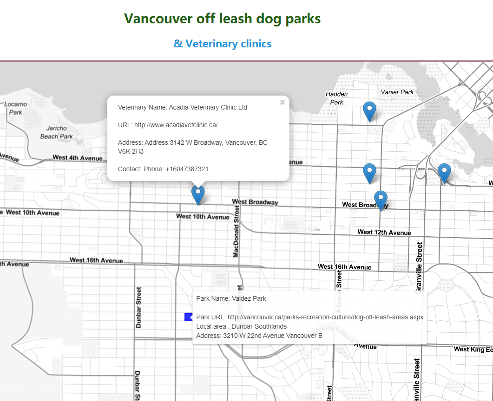

# Vancouver dog off-leash parks and vaterinary information

Link to map:https://aleccai.github.io/ChengCai-Web/GEOG472LAB2/off-leash-parks_and_Vaterinary.html

Collaborations and reliance on other resources:
    For my off-leash-park data in this assignment I downloaded the GeoJSON file from the Open Data Portal. For the data of the veterinary hospital, I found the information from Google Map, and then edited and downloaded it in geojson.io. These are my two main sources of data.

Reflective analysis 
    The primary users of this map are people who own dogs.  I am creating this map because I have two dogs , a poodle and a husky, and I have raised them for six years, so I understand the difficulties of raising a dog.  Raising a dog is like raising a child. It's not just about feeding. At the same time, we also need to take care of the dog's physical and mental health.  So this map shows all the off-leash dog parks and all the veterinary hospitals in Vancouver. Including some information such as their location and website telephone.  People can look for the nearest dog park and hospital according to where they live. At the same time, it can also provide information for those who are renting a house, whether there is a dog park near to the house or whether there is a nearby hospital when they need to be vaccinated or see a doctor.  In the above information, I think this map is good, but there are also some shortcomings. For example, I didn't find more data about the housing information that can keep pets. I know how difficult it is to rent a house where pets can be kept in my personal experience. Therefore, if I can add information about accommodation, food, entertainment, and medical care to the map, this map to people with pets in Vancouver is valuable. Pets are spiritual sustenance for a new migration and an essential factor in having a home in a new place to live. Therefore, to improve Vancouver's new migration population's happiness index, I think my map is still significan
    My idea is to keep everything simple and show what users need most simply and conspicuously.  I added two "show all" buttons and a highlight button. The two "show all" buttons are like switches of two layers, which can display all the information, and the two layers can also exist at the same time.  Then I added a highlight button, which can help me connect the off-leash park to the veterinary hospital.  For example, if my dog ​​was injured in Valdez park.  First, I highlight Valdez park, like the screenshot above, and then I open all the veterinary hospitals' layers; I can see that the nearest hospital to me is Acadia veterinary so that I can choose to see a doctor at the nearest hospital.
    In this assignment, I tried to toggle the current layer, but I failed. I tried removeLayer and use Boolean to return a  base map, but they were all unsuccessful. If it can be improved, I want to add a toggle to control the corresponding layer's opening and closing.  This process will make the map looks more concise and clear.
